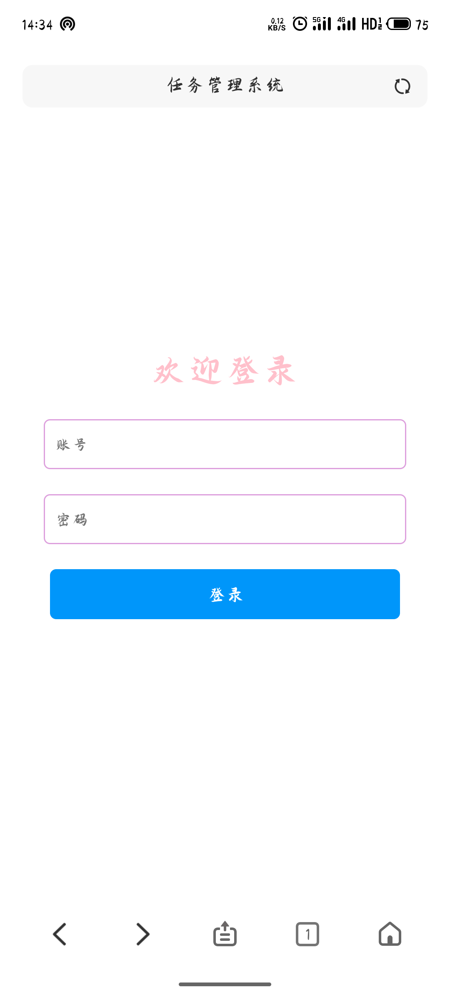
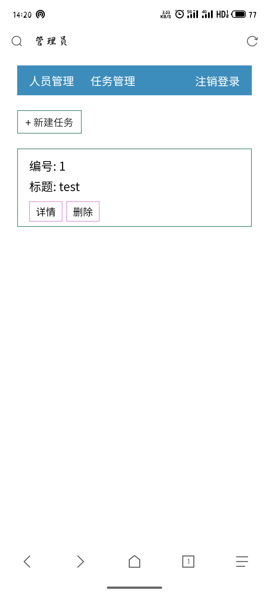
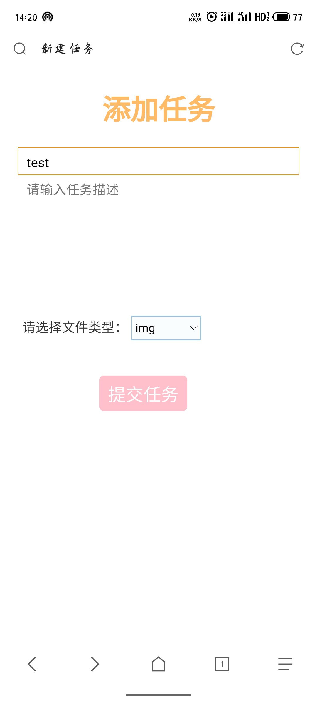

# 图片收集系统

## 当班长时为了收青年大学习写的
有需要的可以免费使用,软件为Visual Code

## 使用方法

1. 克隆或下载压缩包到本地
2. 安装python的虚拟环境,在终端执行
```python
  # 使用清华大学的源会更快
  pip install virtualenv -i https://pypi.python.org/simple/
```
3. 进入项目根目录
```python
  # 在项目根目录下创建ENV虚拟环境
  virtualenv ENV
```
4. 激活虚拟环境
```python
  cd ./ENV        # 跳转到虚拟环境的文件夹
  activate.bat    # 激活虚拟环境
```
5. 修改数据库配置文件
```python
# /config/settings.py
DATABASES = {
  'default': {
      'ENGINE': 'django.db.backends.mysql',
      'NAME': 'taskmanage',   # 数据库名
      'USER': 'root',    # 数据库 用户名
      'PASSWORD': 'QAZplm159357#',# 数据库 用户密码
      'HOST': 'localhost', # 数据库服务主机名
      'PORT': '3306',      # 数据库服务端口
      'CONN_MAX_AGE': 0
  }
}
```
6. 创建Django的默认数据表
```python
  python manage.py migrate
```
7. 安装requirements里的python库
```python
  # 使用清华源
  #7.1下面是网上搜的
  # pip install -r requirements.txt
  # 7.2我自己的笨办法#，安装时，请替换 xx == 3.1.0
  pip install -i https://pypi.tuna.tsinghua.edu.cn/simple xx==3.1.0
```
8. 创建超级管理员用户
```python
# 依次输入 登录名、email、密码
# 注意输入密码时，终端不会显示字符，尽管输就可以了
python manage.py createsuperuser
```
9. 更改需要提交的用户
```python
# ./upload/excel/提交名单.xlsx
# 不可更改表头，内容可随意填写
# 注意：由于本班同学没有重名的 所以判断是否提交以名字判断，若有重名同学，可在名字区分，或有能力更改代码也可
```
9. 启动服务器
```python
  python manage.py runserver 0.0.0.0:80
```
10. 浏览器输入 localhost/login.html  

开始使用本系统吧

### 后记
可能会使用Vue3 重写该系统，目前就这样

### 项目图片





